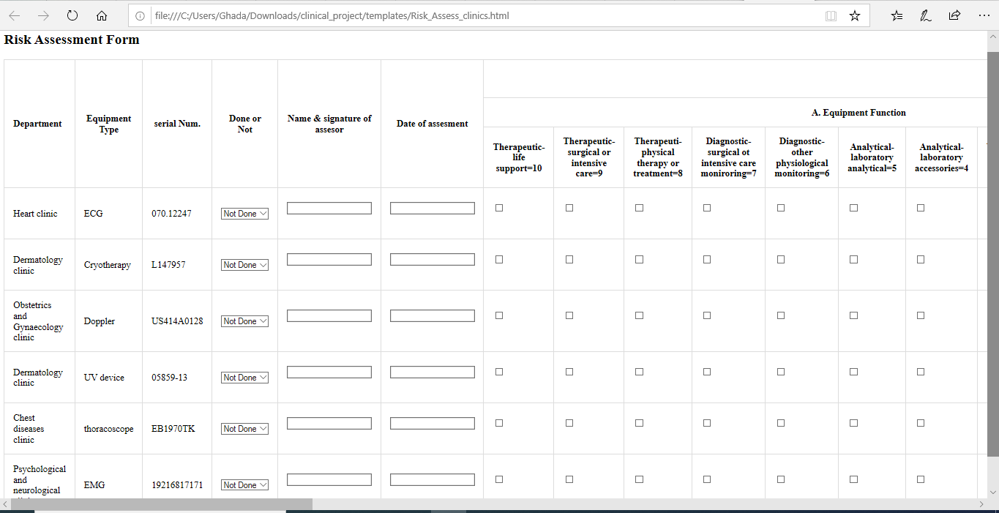
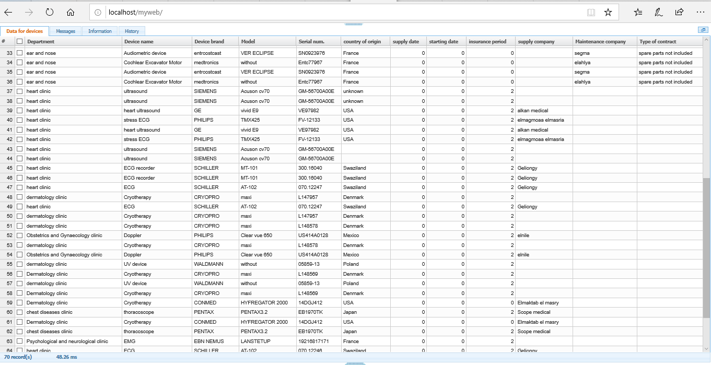
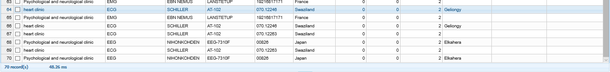

 
 # Clinical Final Project(Team 13)
 
 
| Name: Poline Atef Samy              | Sec:1     | BN:23     |
| ----------------------------------- | --------- | --------- |
| **Name: Toaa Mahmoud Abd-ElHakim**  | **Sec:1** | **BN:25** |
| **Name: Samar Ibrahim Antar**       | **Sec:1** | **BN:40** |
| **Name: Sondod Mohammed mohammed**  | **Sec:1** | **BN:42** |
| **Name: Ghada Adel Abd-ElAziz**     | **Sec:2** | **BN:12** |
| **Name: Menna Tollah Raafat**       | **Sec:2** | **BN:34** |

# Over View :

In our Project we made a database system for a hospital consists of  
 - Out patient clinicals (Heart Clinic,physiological and neurological clinic,chest diseases clinic and dermatology clinic)
 - Otolaryngology Department (Ear, nose and throat **ENT**) 
 - Dental Department

# Technique used :
In our project we used (Python Flask) as a Back-end ,(Html,CSS) as front-end and MySql (for our database for hospital).

We made  Web page the user can choose the department he wants and click on the link the he will be directed to the page where he can download old reports to view it ,and if he is a doctor or an engineer and wants to add some edits to the reports he will enters his username and password to acces the data and add his Edits and comments and edited reports ,then this data will be saved to the database we created on MySql , and we can retrieve these data and reports again.

# Reports 
We made 3 Reports in our Project 

 - **Daily Inspection** for Dental Department.
 - **PPM** for Otolaryngology Department.
 - **Risk Assessment** for out patient clinics. 

 
# **Daily Inspection** for Dental Department :
In this report we made a checklist for (daily inspection)
the Biomedical Engineer or the doctor should fill this report to check that all equipments,devices other are working well ,and their comments if their any errors found with the date exactly so we can fix it as soon as possible

# PPM for Otolaryngology (Ear,Nose and Throat) Department :
In this report we made a preventative planned maintenance(PPM) for the equipment in this department for example (Ear Pressure gauge) we assessed its 
- parts to be maintenad
- Cause of Failure
- description of Equipment Failure
- Date ,Serial Number
- Time required


# **Risk Assessment** for out patient clinics :
It consists of checklist for assessment criteria scores.

Each department in the report has a score of each assessment criteria such as A. equipment function or B. risk assosiated with equipment failure and so on..

The value of Total score depends on each score of each assessment criteria A, B, C, D and E .

According to the value of Total score, an engineer can put the result of inventory classification for each equipment (High, Medium, Low or hazard risk ).

# Data for equipment:
Here are some Screenshots for our data for the hosipital 


# The procedures to open the file and more expalanation:
 # Introduction

We use python flask in our database application. One of the most popular databases is MySQL.

## **Prerequisites**

1. AMPPS installation check course homepage
2. install python recommended Anaconda distribution
3. install mysql connector for python

## **Required installations**

## 1. Ampps Installation

visit [AMPPS](https://www.ampps.com/downloads) and download the latest version according to your distributions.

windows
for installation please follow regular installation steps (next » next » finish)
please make sure you have internet connection during installation
Linux
please make sure you have internet connection during installation. type the following command after routing to download directory.

```
cd /download/location
chmod 0755 Ampps-<version>-<arch>.run
sudo ./Ampps-<version>-<arch>.run
```
To run ampps

```
sudo /usr/local/ampps/Ampps
```
### **On startup**

You should see something like this indicating the server has started properly.


### **common issues for LINUUX installation**

if you have a problem installing ampps on linux type the following:

```
cd /usr/local/ampps/apache/lib
sudo mkdir backup
sudo mv ./libapr* ./backup/
sudo apt-get -y install libaprutil1 libaprutil1-dev libapr1 libapr1-dev 
```

then restart your device and run the following every time you want to start it.
```
cd ~
sudo QT_X11_NO_MITSHM=1 /usr/local/ampps/Ampps 
```

### **start ampps**
type the following in your browser [http://localhost/ampps/](http://localhost/ampps/) you should see


## 2. Getting Started with Python: Installing Anaconda

### [Download Anaconda 3 (Python 3)](https://www.anaconda.com/products/individual)

## 3. Python Mysql connector

install mysql connector for python by running this command on Anaconda Prompt

```p
conda   install -c anaconda mysql-connector-python 
```
### **To check everything is going well**

1. start Ampps server
2. run the following python code

```p
import mysql.connector

mydb = mysql.connector.connect(
  host="localhost",
  user="root",
  passwd="mysql"
)

print(mydb) 

```
you shpuld see

```
 <mysql.connector.connection_cext.CMySQLConnection object at 0x7fdcf9307790>
```

We implemented many tables on ampps server lets check if they existed: you should see all databases implemented on your ampps

```P
import mysql.connector

mydb = mysql.connector.connect(
  host="localhost",
  user="root",
  passwd="mysql"
)

mycursor = mydb.cursor()

mycursor.execute("SHOW DATABASES")

for x in mycursor:
  print(x)
```
# Python server

Now we need a running server to recieve user request using jason and send back resulted jason file.

First, wee need to install python server. recommended flask 

Note: AMPPS localhost-home has to be openned during running server

run this command on Anaconda Prompt

```
conda install -c anaconda flask 
or 
pip install -u flask
```
## **Anaconda Prompt Terminal** (step by step)
At first, you should to go to the **clinical_project** directory by running the following command:
```
cd C:\Users\Ghada\Downloads\clinical_project
```


### **The rest commands required**

```
py -m venv env
```

```
env\Scripts\activate
```
```
pip install flask
```
```
set FLASK_APP=server.py
```

```
flask run
```
Finally When you open [http://127.0.0.1:5000](http://127.0.0.1:5000) flask will direct the browser to the index.html file

## **About our web application** (html pages)

1. **register:** An engineer can  register his username, ID and email from [register](http://127.0.0.1:5000/register.html) link then, his person data will be saved direct in **engineers table** found on MySQL database .


when 
2. **index:** Now, any registered engineer can login to the home page from [login](http://127.0.0.1:5000/index.html) link


3. **home:** [home](http://127.0.0.1:5000/home.html) link includes some links as the following:


4. **profile:** this page includes the last registered engineer data  


5. **logout:** when you click on [logout]() link from the home page, you back to login/index or register page


6. ### Departments :
   6. I. **dental:** [Dental Department](http://127.0.0.1:5000/dental)
   

   when you click [Daily Inspection Form](http://127.0.0.1:5000/daily) link, you get this form.
   
   

   when you fill this form and click submit
   
   

   , the date stores direct in **dialy inspection table** in MySQL database
   

   when you click [Generate Daily Inspection Report]() link, the server calls the data stored in **dialy inspection table** in MySQL database then download and show them as an excel sheet like this
   

   when you click[ Dental Equipment]() link, the server calls the dental equipment from **devices table** from MySQL database. 
   

   and show them in [http://127.0.0.1:5000/dental_equipment](http://127.0.0.1:5000/dental_equipment)
   


   6. II. **clinics:** [Out Patient Clinics](http://127.0.0.1:5000/clinics)
    

   when you click [Risk_Assessment Form](http://127.0.0.1:5000/Risk_Assess_clinics) link, you get this form.
   
   
   

   when you fill this form and click submit
   
   
   
   

   , the date stores direct in **risk_assess table** in MySQL database
   

   when you click [Generate Risk_Assessment Report]() link, the server calls the data stored in **risk assess table** in MySQL database then download and show them as an excel sheet like this
   

   when you click[Clinics Equipment]() link, the server calls the dental equipment from **devices table** from MySQL database. 
   

   and show them in [http://127.0.0.1:5000/clinics_equipment](http://127.0.0.1:5000/clinics_equipment)
   
   
   


   6. III. **Otolaryngology:** [Otolaryngology_Department](http://127.0.0.1:5000/otolaryngo)
   

   when you click [PPM Otolaryngo Form](http://127.0.0.1:5000/otolaryngo) link, you get this form.
   

   when you fill this form and click submit, the date stores direct in **ppm_laryngo table** in MySQL database
   

   when you click [Generate ppm_Otolaryngo Report]() link, the server calls the data stored in **ppm_laryngo table** in MySQL database then download and show them as an excel sheet like this
   

   when you click[Otolaryngo Equipment]() link, the server calls the dental equipment from **devices table** from MySQL database. 
   

   and show them in [http://127.0.0.1:5000/Otolaryngo_equipment](http://127.0.0.1:5000/Otolaryngo_equipment)
   

   7. **Equipment:**

   when you click[Equipment Inventory]() link found in [home](http://127.0.0.1:5000/home), the server calls the dental equipment from **devices table** from MySQL database. 
   
   
   
   

   and show them in [http://127.0.0.1:5000/Otolaryngo_equipment](http://127.0.0.1:5000/Otolaryngo_equipment)
   
   
   ## **Conclusion**

   You can find all html pages inside **tamplates** folder.

   HTML Pages will be connected to each other when you run the server by following the steps and commands at the part of **Python server**.
